# 🟢Green Light

## ShootingApp

Flaminio villa - Raffaele Confalonieri - Nicola Zuardi

<aside>
❓ Documentazione e progetto di una web application come gestore di un poligono di tiro

</aside>

## Introduzione

### Scopo dell’applicazione

L’applicazione è stata creata con lo scopo di fornire a tutti i gestori di un poligono di tiro, un modo semplice ed efficace per la gestione di prenotazioni e assistenza a tutti i suoi iscritti. 

Partire dalle necessità e richieste di una crescente popolarità per le discipline di tiro sportivo.  Basti vedere come si sono mossi i vari organi di stato, per venire in contro a tutti gli atleti e appassionati italiani, di partecipare a gare internazionali che richiedevano delle specifiche che fino ad allora erano proibite in Italia. [[Abolizione del divieto per il 9x21mm](https://www.armimagazine.it/abolito-il-divieto-di-usare-il-calibro-9x19-in-italia/)].

Solo recentemente anche questo campo ha iniziato a prendere posto nel cyberspazio, ma la maggioranza di esse non si spingono molto oltre il livello informativo. 

L’obiettivo si centra, sul creare un applicativo che possa essere largamente distribuito nei luoghi predisposti a tali attività. Tale contesto, si distingue da molti altri per la particolare attenzione che si deve prestare alla sicurezza e alle leggi su: possesso, porto e uso di armi da fuoco. Si prevede quindi l'implementazione in una struttura con un proprio grado di sicurezza e in proprio contatto con le autorità.

I fruitori di questo servizio saranno maggiormente gli appassionati già iscritti ad un poligono di tiro e potenzialmente, chiunque volesse visitare la pagina web relativa ad un singolo poligono.

In questo elaborato riportiamo negli esempi dell’applicativo, un poligono e iscritti di nostra immaginazione.

### **Glossario**

La seguente documentazione è scritta in italiano, in alcuni casi  verranno usati termini inglesi, dal momento che, in ambito informatico, vengono comunemente utilizzati. Per aiutare chi non comprendesse alcuni di essi, riporto il seguente glossario.

**TSN**: Tiro a sego nazionale è un poligono di tiro  pubblico diretto e gestito da un presidente che fa parte del consiglio nazionale dell'Unione Italiana Tiro a Segno (UITS).

**Banchina:** Area delineata per l’attività di tiro statico. Una banchina viene divisa per postazioni di tiro. 

**Postazioni di tiro**: frazione che taglia per lungo della banchina in cui un singolo cliente può appoggiarsi ad un piano, per far pratica; sparando verso la sagoma post alla fine della postazione

**User** : colui che fa uso dell’applicazione e dei suoi servizi, ci riferiremo ad egli usando anche il termine tiratore o cliente

Admin:

**Web App**: abbreviazione di Web Application, ovvero un applicativo distribuito e disponibile in rete 

**ACK: (***Acknowledgment)* ****usato in informatica e telecomunicazioni per simboleggiare un segnale di riconoscimento di un informazione giunta per intero

**Request/reply** : nelle campo delle reti si usa per indicare uno scambio di informazioni partendo da una richiesta ad una qualunque risorsa.

**DTO: [***data transfer object/*oggetto di trasferimento] definisce il modo e i campi con cui i dati  verranno inviati per la Web App. 

### Descrizione del contesto

Scendendo nello specifico, possiamo comprendere al meglio le richieste che si possono creare.

Ogni regolare cittadino Italiano che si volesse iscrivere ad un poligono di tiro, anche se provvisto di porto d’armi o certificato di uso e maneggio deve presentarsi in sede per l’iscrizione. Questo passaggio è fondamentale poiché bisogna accertarsi di persona dell’identità di chi avrà in mano un’arma. Le segreterie hanno il compito quindi di accogliere ogni cliente, richiedere documento di identità oltre a tutti i documenti vitali per la procedura di iscrizione. Secondo le norme vigenti è necessario presentare certificato per una visita da parte di un medico militare e uno specifico certificato medico sulle condizioni psicofisiche dell'interessato. La responsabilità di tali documenti esula dal sistema presentato.

Se tutto è in regola la segreteria procederà a mettere in archivio i documenti e svolgere le varie pratiche.

Il passo successivo e fondamentale è quello di seguire un corso specifico sulla sicurezza del poligono a cui ci si sta iscrivendo (esso è uguale per la parte di uso e maneggio dell’arma ma differisce di sede in se a seconda di come è stato progettato l’impianto).

Al termine del corso l’utente verrà registrato e gli verrà fornito un proprio tesserino che gli permetterà di accedere ai vari impianti.

Ogni iscritto sul proprio tesserino ha riportato un codice identificativo e e i propri estremi.

Ogni qualvolta un tiratore vuole esercitarsi deve prima recarsi in segreteria per dichiarare a che distanza si andrà ad allenare. Può far riferimento  alla stessa segreteria per richiedere il noleggio di un arma, acquistare cartucce e altri accessori  ( come tappi per le orecchie, bersagli specifici).

A questo punto il tiratore si recherà in armeria se ha noleggiato un’arma, per  poi procedere verso la banchina dove sono presenti degli istruttori che potrebbero assisterlo.

## Raccolta e analisi dei requisisti

## **Funzionalità richieste**

Al termine dell’iscrizione e del corso propedeutico per la sicurezza nel poligono, la segreteria provvederà ad inserire nel DB le credenziali del cliente.

Lo user riceverà una e-mail per ultimare il processo di iscrizione e scegliere da sé la password, così da non violare la privacy ed effettuare subito un cambio. La e-mail sarà provvista di un QR code, da cui riscattare il proprio tesserino. Con esso verrà svelato il proprio codice identificativo. Ad esso verrà abbinata la password personalizzata inserita nella pagina correlata al link della e-mail. Solo al termine di questa operazione lo User sarà in grado di effettuare il login nella piattaforma.

Quando uno user non loggato visita la Web App, verrà mostrata una home-page in cui sono riportate solo delle generalità sul poligono e il pulsante di login. A fini di esempio, in questo progetto tali generalità verranno riportate in minima parte,  trascurando sezioni come le FAQ, listino prezzi, note legali ecc.

Nella home, per poter accedere a tutte le funzionalità disponibili, si dovrà effettuare il login. Se il client collegato è un abbonato al poligono effettuerà l’accesso utilizzando il proprio codice identificativo.

Dopo il login, lo user verrà portato alla Home aggiornata, con la possibilità di accedere alle funzionalità riportate nei requisiti funzionali (descritti successivamente).

Qualora a fare l’accesso non sia un utente, ma bensì chi lavora presso il poligono come:  i segretari, armieri e alcuni istruttori, gli verrà richiesto l’indirizzo e-mail per fare l’accesso. Questa decisione viene dalla necessità di non far entrare user con tesserino scaduto e allo stesso tempo garantire ai dipendenti un accesso con una chiave identificativa che non possa variare nel tempo a meno che non la si cancelli dal sistema alla recessione del contratto col dipendente (una mail di lavoro continuerà ad esistere a differenza dei tesserini degli utenti che hanno una scadenza)

L’utilizzo di una mail di lavoro, permette di gestire facilmente comunicazioni di servizio, impegni e scadenze come accadrebbe in una normale azienda. Nel caso dell’istruttore anche le prenotazioni e avvisi.

A seconda del service provider tutti gli impegni possono essere calendarizzati automaticamente sul dispositivo del dipendente. 

## Requisiti funzionali

Compreso il corretto funzionamento di quanto riportato nel capitolo precedente.

Di seguito specifichiamo meglio le azioni che che possono essere fatte dagli utilizzatori dell’applicazione

- **User**
    
    **Prenotare una postazione di tiro**: ogni postazione appartiene ad una banchina che ne definisce le caratteristiche di conseguenza  (se una banchina è al chiuso lo sono tutte le postazioni di tiro; se è progettata per sparare sui massimo 25m ogni postazione segue lo stesso)
    
    **Noleggio di un’arma dal catalogo:** nella prenotazione si potrà aggiungere un’arma; a differenza della maggior parte dei poligoni, si potrà vedere una lista di quanto offerto dall’armeria. La lista è sempre aggiornata sulle disponibilità e stato dell’arma.
    
    **Visione dello storico-prenotazioni:** Nel database ogni dato viene salvato come registro, l’utente potrà visualizzare tutte le sue vecchie prenotazioni.
    
    **Prenota istruttore**:  Lo user potrà visualizzare la lista degli istruttori presenti al poligono, e richiederne la presenza ad una delle sue sessioni di tiro nella fase di prenotazione così da poter essere seguito nella pratica dell’esercizio. 
    
    **Valutazione istruttore**: qualora l’utente volesse, può valutare un istruttore di tiro con un voto da 1 a 5. Questa pratica consente di comprendere meglio le abilità di ogni istruttore agli utenti e il resto dello staff.
    
- **Admin**
    
    **Registra utente:** Inserisce le credenziali del nuovo user iscritto
    
    **Registra istruttore**: Aggiunge un membro dello staff alla Web App 
    
    **Registra admin:** aggiunge un nuovo membro dello staff con tutti i privilegi per effettuare modifiche
    
    **Modifica/elimina/ricerca dati:** Il profilo admin è l’unico qualificato a visualizzare e alterare i dati degli utenti, ed istruttori come visto prima; e allo stesso modo per quelli inerenti la struttura e proprietà (banchina, armi, servizi, ecc.).
    
- **Istruttore**
    
    **Riceve email di avviso nuova valutazione**
    
    **Riceve email di prenotazioni**
    
    **Login sulla pagina web:** è una funzionalità comunque concessa agli istruttori senza profilo admin per visionare quanto riportato sul sito
    

## Architettura

L’applicazione segue un pattern client server, in cui distinguiamo le due entità costituenti ovvero colui che richiede servizi (User), e colui che fornisce i servizi (Server). 

La richiesta ad ogni servizio, viene effettuata dall’interazione utente col server. Essa viene gestita da un interfaccia grafica, che gestisce il flusso di tutte le request/reply . Per far ciò, essa comprende le porte client, per chiedere e ricevere servizi, come quelle del proprio server. 

Per creare un sistema largamente distribuito come una Web App, seguiamo il pattern MVC.

Il Model-View-Controller è anch’esso intuitivamente formato da tre entità che collaborano tra loro. Il codice viene distribuito per funzionalità in ognuno di esse ottimizzando il lavoro e permettendo performance più adatte ad un utilizzo in rete.

Il Model è il cuore di questo pattern, contiene tutti i dati e funzionalità dell’applicazione. Da solo sa eseguire ogni operazione richiesta, ma non sa presentarla all’utente finale.

Un View mostra dunque i dati e le richieste interpretabili per lo user. Di per se una View non manipola dati.

Il Controller è il filo che congiunge gli input del client presi dalla View, con i metodi presenti nel model.

Il **front-end** della web application è stato realizzato oltre alla base HTML e CSS, usando il framework **Angular** assieme a TypeScript con l’intento di presentare una single-page application. Questo tipo di applicazione web è formata da una pagina strutturata dai vari component; quando si fanno nuove richieste o si crede di passare da un a pagina all’altra in realtà quello che cambia sono solo i component.

Angular infatti segue un’architettura component-base. Definiamo un component come un unica entità composta da [classe TypeScript, un component decorator, una classe CSS Html]

Il **component** racchiude in se il necessario per funzionare da sé, senza dover far conto ad altri component. Uno stesso component può essere riutilizzato più volte, lasciando il progetto organizzato e leggero. 

La parte front-end non comunica direttamente con il DB; per la memorizzazione dei dati, vengono utilizzate delle **JPA** con l’estensione di Hibernate.

Le Java-Pesistance-API specificano come conservare i dati nelle applicazioni java. **Hibernate** è un framework ORM (Object-Relational-Mapping) divenuto ormai uno standard per far interagire oggetti java con il database. Esso parte dal JDBC per generare ed eseguire query al data base. (Java DataBase Connectivity driver che funge da interfaccia per collegare java con un qualsiasi DBMS)

L’applicazione **Back-End**, è stata scritta in Java usando il framework di SpringBoot. Esso è tra i più utilizzati nella creazione delle applicazioni web per tutte le sue specifiche funzionalità; che non erano presenti nella precedente versione Sprig.

 Tra i vantaggi di usare **SpringBoot** che sono stati vissuti in prima persona per la creazione di questo progetto è stato proprio il modulo sulla sicurezza. Implementando **Sprig Security** le operazioni di autenticazione e supporto. [Spring Security](https://docs.spring.io/spring-security/reference/index.html) è framework che assiste nelle fase di autenticazione autorizzazione e protezione verso gli attacchi più comuni.

Il codice è strutturato su diversi package qui descritti

- **Model:** nelle sue classi vengono definiti i metodi  che mappano la struttura del Database facilitando l’accesso ai suoi dati.
- **Controller:** sono il punto più lontano che la chiamata web può fare all’applicativo. Esso coordina e organizza le chiamate alle API
- **Service:** posto tra i controller e le repository, i service effettuano la manipolazione dei dati
- **Repository:** dove vengono effettivamente salvate le query da eseguire. Esse sono tutte le query richieste e operazioni CRUD (Create, Read, Update, Delete).

Infine, l’applicazione conserva tutti i sui dati in un **Data-Base** SQL implementando come DBMS **MariaDB** ( gestore della base di dati, open source che ha acquisito sempre più popolarità tra gli sviluppatori)

## Class Diagram

Qui vengono riportate tutte le entità, protagoniste di questa applicativo, con le  corrispettive relazioni tra loro. Riportiamo successivamente una breve descrizione delle classi al fine di comprendere meglio quanto riportato.

Per creare questo diagramma delle classi è stata usata una funzione di IntelliJ che aiuta ad avere una rapida bozza dello schema partendo direttamente dal codice.

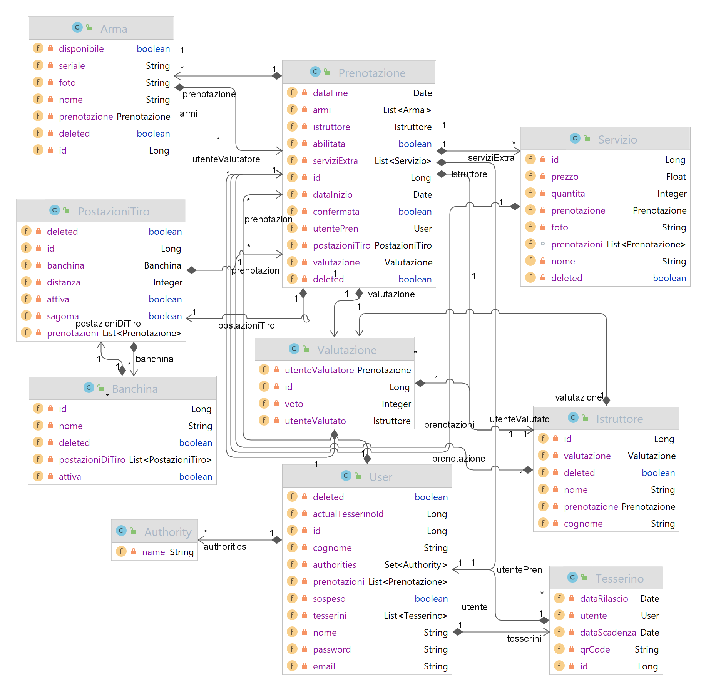

Uno nuovo User, una volta istanziato è composto dai suoi estremi. aprendo la mail dell’iscrizione l’utente entrerà in relazione con il suo tesserino. (prendendo l’authority che gli permetterà di fare quanto segue).

Uno User può effettuare più prenotazioni. Segnando su di essa l’eventuale presenza di un Arma appartenente al sistema, un istruttore che presenterà servizio allo User durante l’effettiva sessione di tiro.

In ogni prenotazione, è riportata almeno una postazione di tiro. Ogni postazione di tiro appartiene ad una banchina. Di fatti una banchina è formata da un  insieme di postazioni di tiro.

Al termine della sessione di tiro, l’utente potrà lasciare una valutazione dell’istruttore.

In ogni prenotazione possono essere aggiunti dei servizi, entità descritta meglio nei progetti futuri. 

## Use Case Diagram

Lo scopo dei diagrammi UML è quello di fornire uno schema grafico e facilmente interpretabile che permetta anche a chi ha basse conoscenze informatiche di comprendere l’applicazione e le sue attività, in particolar modo lo use case diagram riassume tutte le possibili interazioni di un personaggio, nel nostro caso vedremo lo user alle prese con l’applicazione web.

Identificheremo nel corso di questa documentazione gli utenti appena iscritti (che non hanno mai fatto il primo set della password), gli iscritti e il semplice visitatore della pagina web come USER. Questa scelta viene fatta dal momento che il modo con cui tutti loro si interfacciano all’applicazione è il medesimo; ovviamente fino a dove le autorizzazioni dell’individuo lo consentono.

Vediamo innanzitutto l’interazione dello User: 

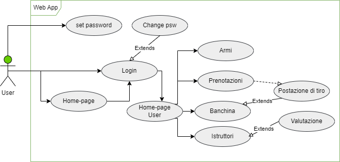

Non vengono riportate le operazioni svolte via mail  (come ricevere il tesserino) poiché esterne alle interazioni sulla Web App anche se gestite dall’applicazione.

L’istruttore non richiede, per le specifiche dell’applicazione attuale, una pagina web poiché tutte le comunicazioni vengono trasmesse sulla mail di lavoro. L’istruttore può così integrare le prenotazioni , ai calendar e  alle notifiche aziendali  con servizi di sincronizzazione.

Mentre lo use case diagram di un admin è il seguente:

.png)

Ricordiamo, come riportato nei requisiti funzionali che solo l’admin ha pieni poteri sul contenuto di tutte le pagine. 

## Sequence Diagram

Lo scopo del Sequence diagram è quello di riportare tutto lo scambio di messaggi e interazioni tra i componenti durante il loro “ciclo di vita” . Ovvero uno scenario ( a prescindere dal tempo) composto da una sequenza ordinata di azioni in cui tutte le scelte sono state già effettuate pertanto non vi son pochi flussi alternativi.

In questa documentazione vengono riportati solo due di questi diagrammi che coinvolgono le attività chiave più complesse.

- **Iscrizione e login**
    
    Non viene riportata la chiamata al DB per motivi di spazio e lasciare l’attenzione su gli attori principali.
    
    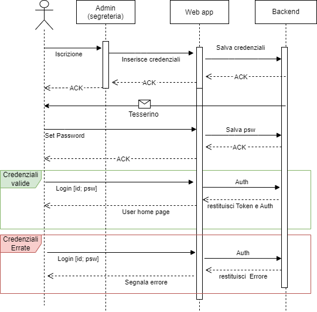
    
- **Prenotazione**
    
    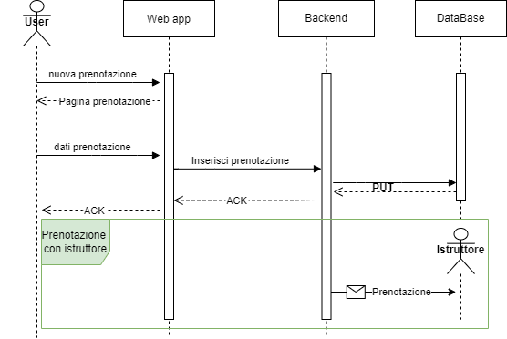
    

## Progettazione base di dati

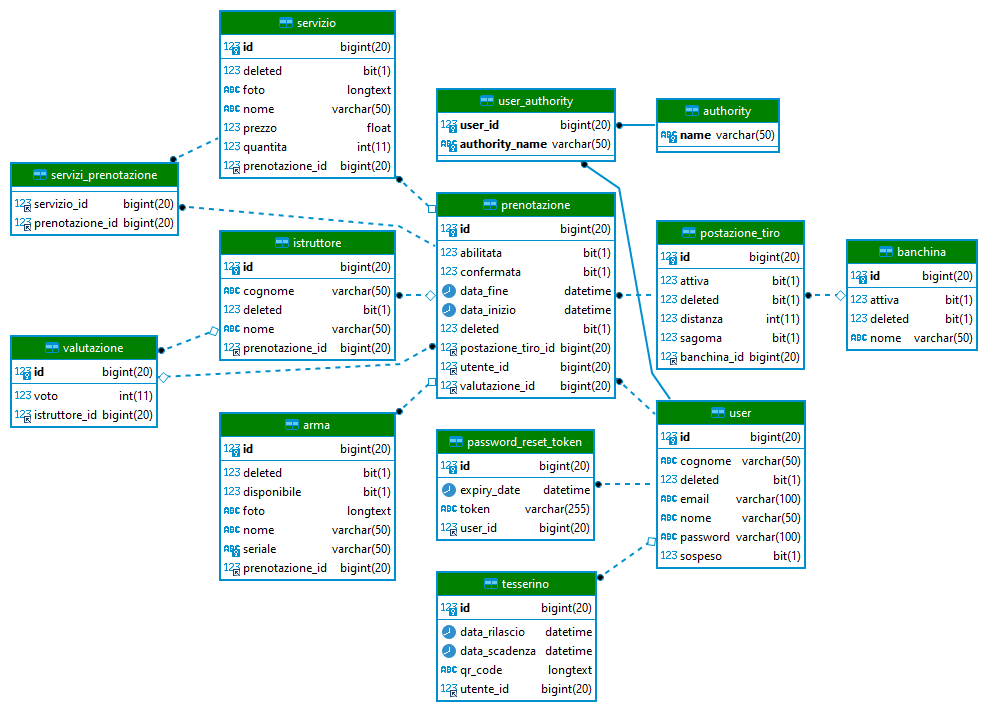

User viene identificato da un proprio Id e contiene obbligatoriamente tutti i dati dell’iscritto, tranne il campo password, che verrà inserito successivamente alla conferma per e-mail.

Tesserino è aggregato ad un utente, come chiave primaria ha il codice riportato sull’effettivo tesserino; ha un QR-code per implementare facilitazioni di accesso. Ha una chiave esterna che lo aggrega all’id user a cui appartiene.

Lo user può avere 0 o più prenotazioni.

In prenotazioni vengono contenuti tutti i dati relativi al giorno di una prenotazione, in particolar modo come chiave esterna fa riferimento a una postazione di tiro e uno user. Può anche contenere l’id di un istruttore che presenzierà a quella prenotazione.

Una banchina è una composizione di postazioni di tiro. Essa è identificabile con un proprio id e nome a seconda del tipo di attività per cui vengono prefissate le postazioni. 

Oggi postazione di tiro ha variabili che possono mutare velocemente, come se attiva contiene una sagoma o è stata smontata. Oltre alla chiave primaria e la distanza rimane l’id della banchina di riferimento.

Istruttore ha le sue generalità, indirizzo mail come id. Contiene la lista delle prenotazioni ha cui ha partecipato.

Ogni valutazione è composta da un id voto e id del istruttore

Servizio contiene i dati del servizio ad una prenotazione o disponibile per più di esse. Al momento questa entità è presente per agevolare future implementazioni di più servizi 

## Api e Test

Qui la documentazione completa di ogni api del progetto

<aside>
 [https://shootingapp.ddns.net/swagger-ui/index.html](https://shootingapp.ddns.net/swagger-ui/index.html)

</aside>

Gli Unit test delle macro-funzionalità sono stati eseguiti in locale con Groovy.

A seguire riporto, a fini di esempio, solo alcune schermate in cui eseguo delle chiamate di test sulle api più principali dal punto di vista della sicurezza. 

**Autenticazione**

Effettuo il login  con le credenziali del primo utente admin generato manualmente. 

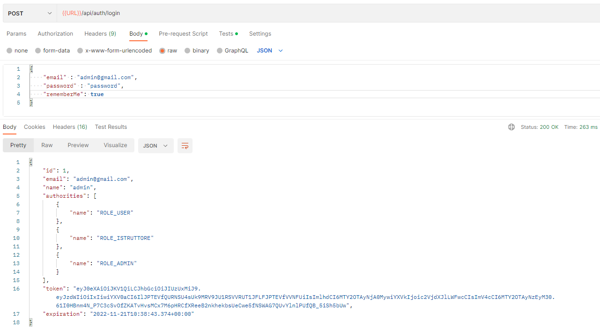

Ricevo risposta con successo. Possiamo notare  come questo utente, essendo un admin, ha tutti e tre le authority.

In fondo alla risposta, viene riportato il campo token. Al fine di risparmiare tempo esso verrà salvato nelle variabili globali assieme all’URL. Questo ci consente di non dover reinserire manualmente ogni test tali paramenti. 

- **Registro/Login nuovo Admin**
    
    **Registrazione Admin**
    
    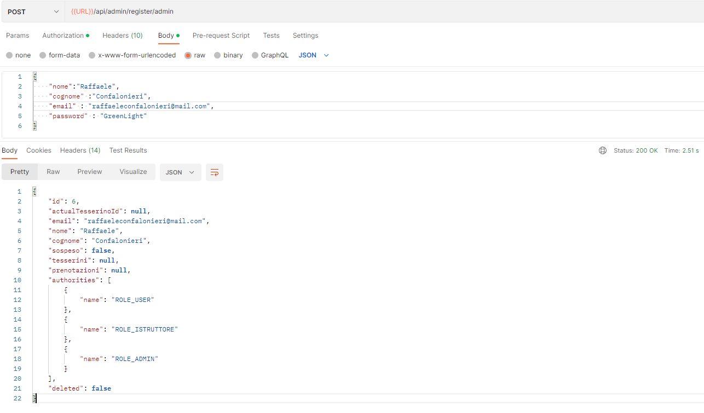
    
    **Login Admin**
    
    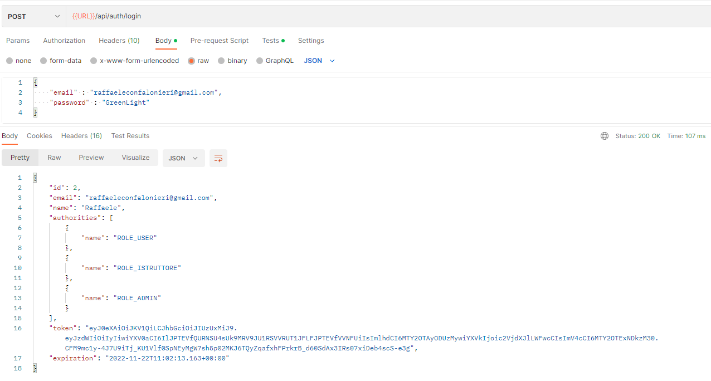
    
- **Registro/Login nuovo Istruttore**
    
    **Registrazione istruttore**
    
    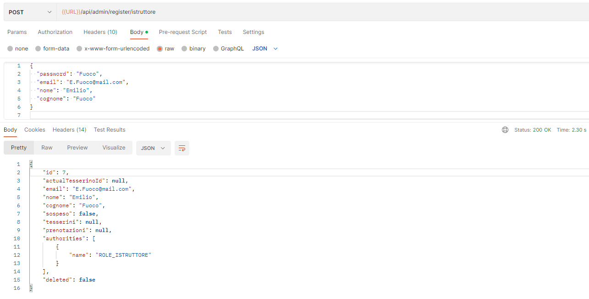
    
    **Login istruttore**
    
    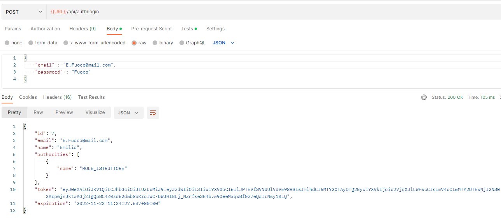
    
- **Registro/Login nuovo User**
    
    **Registrazione user**
    
    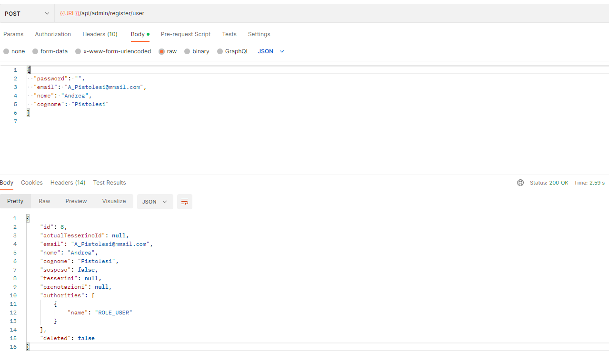
    
    *La mail per impostare la password, che verrà recapitata all’indirizzo inserito, segue il seguente schema:* 
    
    [mail esempio.pdf](screen/mail_esempio.pdf)
    
    **Registrazione user con password (a fini di test)**
    
    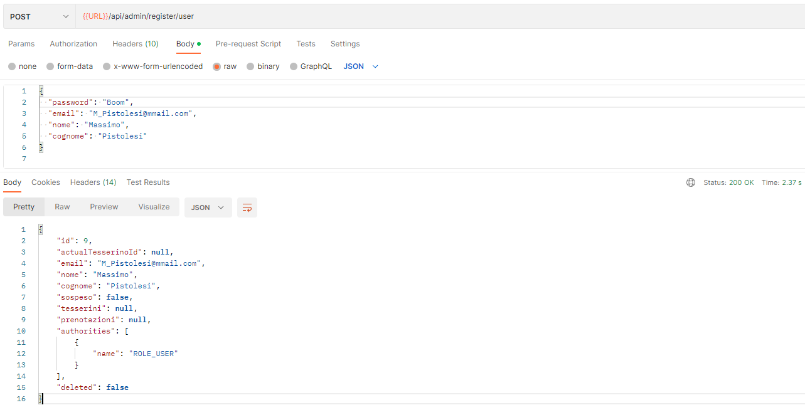
    
    **Login user con password (a fini di test)**
    
    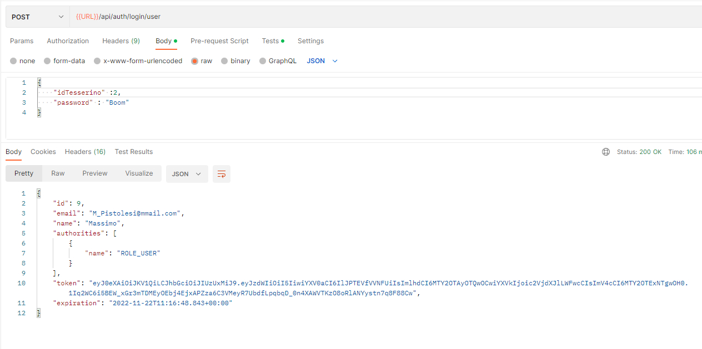
    

## FrontEnd

Le schermate riportate sono state riprese dopo una normale iterazione da parte dell’admin. L’interfaccia grafica non è completa né è stata curata per una presentazione ufficiale; ha lo scopo di dare un idea di cosa aspettarsi una volta entrati nella Web App

- **Homepage**
    
    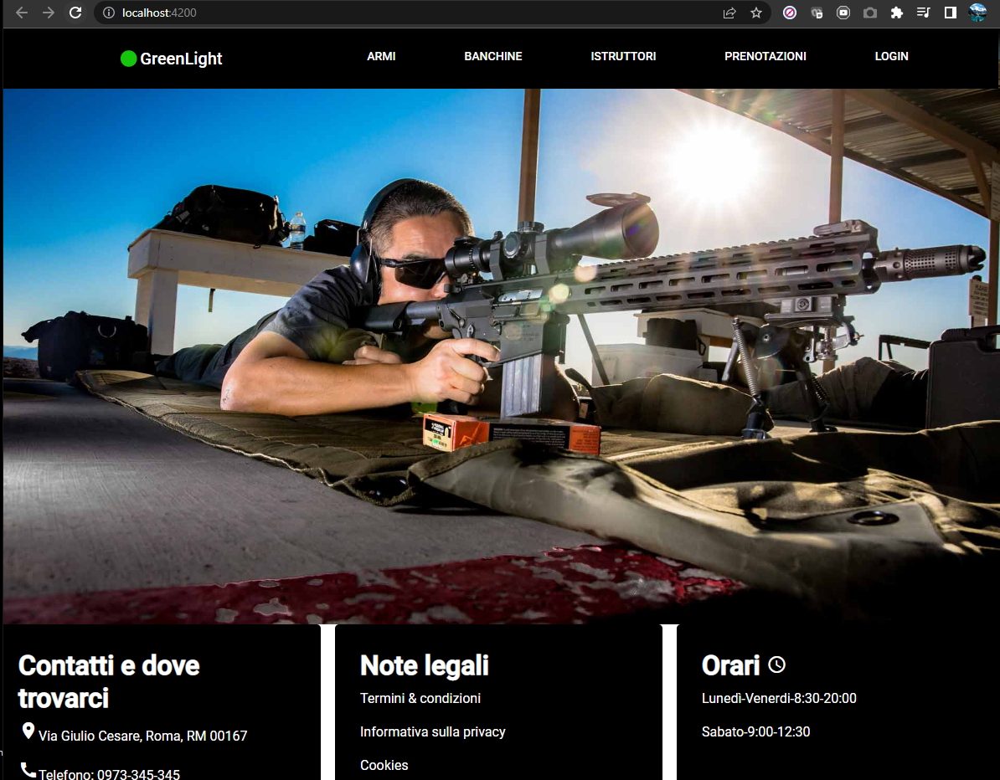
    
- **Login**
    
    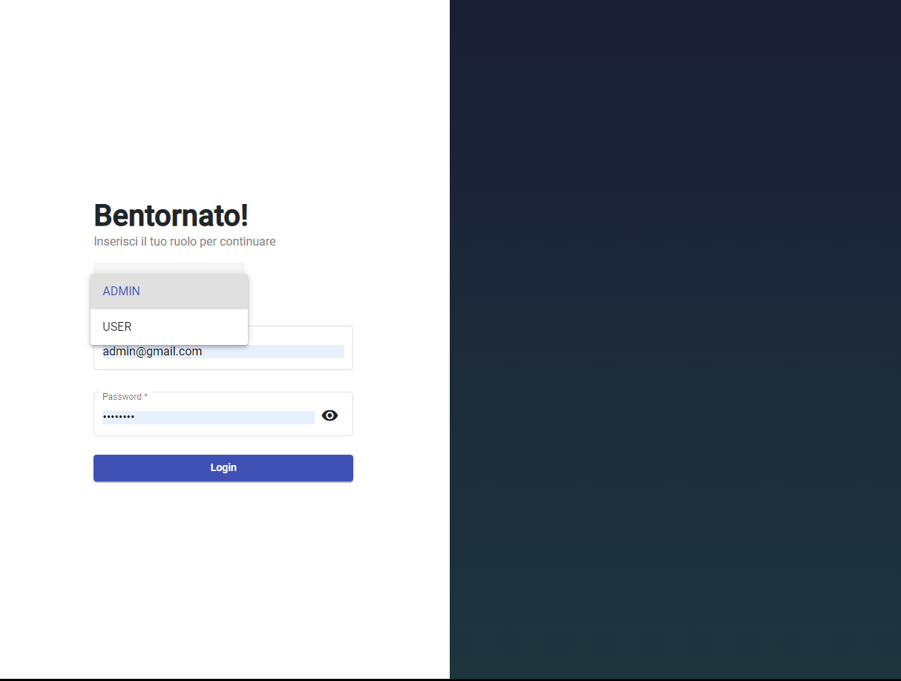
    
- **Armeria**
    
    In queste schermate accediamo alla pagina come Admin, per tale motivo viene riportato il segno “+” e la possibilità di modificare i valori delle armi prima inserite.
    
    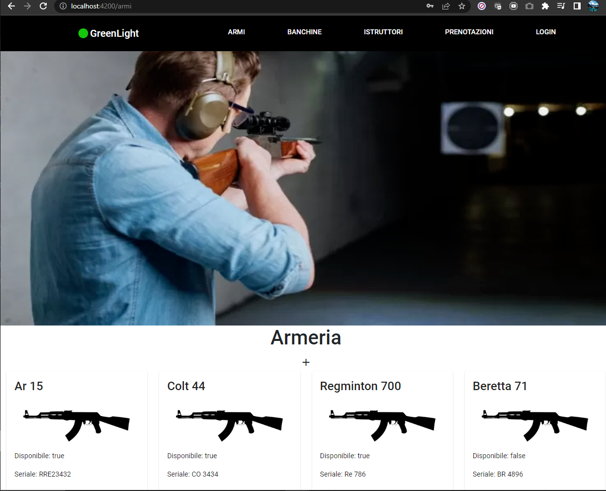
    
    **Inserimento di una nuova arma nel poligono**
    
    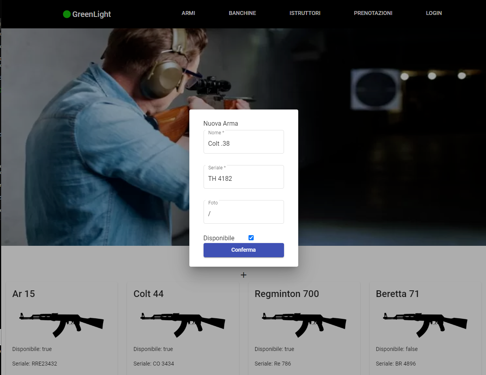
    

## Progetti futuri

L’applicazione ovviamente non è al massimo del suo potenziale. Sicuramente sulla pagina iniziale si potrebbero aggiungere: una bacheca eventi, FAQ, listino di altri prodotti e/o servizi tipici di molti poligoni muniti di armeria propria. 

Questo può essere facilmente implementato dalla classe di “SERVIZIO”, in cui in futuro potranno essere aggiunte nuove opzioni, come ad esempio: prenotare accessori, richiedere materiali o una nuova esperienza di tiro( Es: scegliere un bersaglio da difesa con una sagoma umana o ludico come sparare a lattine e barattoli).

Per i gestori potrebbe essere interessante registrare degli abbonamenti che distingueranno gli user nei servizi o nelle armi che possono richiedere.

In particolar modo si avrebbe piacere nel fare una sezione dedicata completamente sulla sicurezza e sull’esperienza che si può avere in questo sport che, solitamente, tende a esser lasciato da parte rendendo i primi passi pieni di dubbi. Si vuole quindi dare una spiegazione di quanto fare a chiunque visiti la pagina, così da avere un punto di riferimento da cui iniziare.

Come è stata realizzata un’applicazione per rendere semplice la pratica a chi appassionato, sarebbe bello poter fare lo stesso anche per chi non ha mai pensato di poter provare.